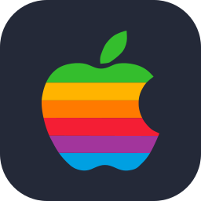
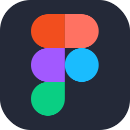
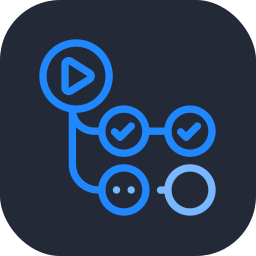
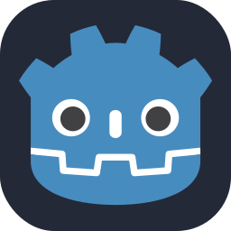
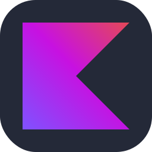
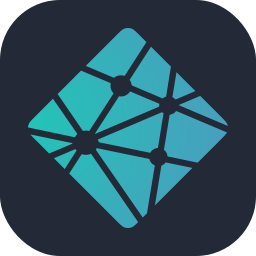
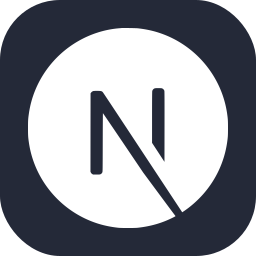
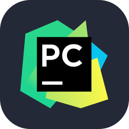
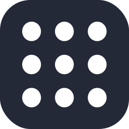
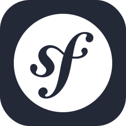

<p align="center"></p>
<p align="center"></p>
<h3 align="center">Showcase your skills on your GitHub or resumé with ease!</h3>
<hr>

<h3 align="center">Powered by Cloudflare Workers ⚡</h3>

<h3>NOTE: To keep icons consistent and to ensure browser support, we don't accept pull requests for icon submissions. If you would like an icon added, please open an issue.<h3>

# Docs

- [Example](#example)
- [Specifying Icons](#specifying-icons)
- [Themed Icons](#themed-icons)
- [Icons Per Line](#icons-per-line)
- [Centering Icons](#centering-icons)
- [Icons List](#icons-list)

# Example

<p align="center"></p>
<p align="center"></p>

# Specifying Icons

Copy and paste the code block below into your readme to add the skills icon element!

Change the `?i=js,html,css` to a list of your skills separated by ","s! You can find a full list of icons [here](#icons-list).

```md
[](https://skillicons.dev)
```

[](https://skillicons.dev)

# Themed Icons

Some icons have a dark and light themed background. You can specify which theme you want as a url parameter.

This is optional. The default theme is dark.

Change the `&theme=light` to either `dark` or `light`. The theme is the background color, so light theme has a white icon background, and dark has a black-ish.

**Light Theme Example:**

```md
[](https://skillicons.dev)
```

[](https://skillicons.dev)

# Icons Per Line

You can specify how many icons you would like per line! It's an optional argument, and the default is 15.

Change the `&perline=3` to any number between 1 and 50.

```md
[](https://skillicons.dev)
```

[](https://skillicons.dev)

# Centering Icons

Want to center the icons in your readme? The SVGs are automatically resized, so you can do it the same way you'd normally center an image.

```html
<p align="center">
  <a href="https://skillicons.dev">
    
  </a>
</p>
```

<p align="center">
  <a href="https://skillicons.dev">
    
  </a>
</p>

# Icons List

Here's a list of all the icons currently supported. Feel free to open an issue to suggest icons to add!

|      Icon ID       |                         Icon                          |
| :----------------: | :---------------------------------------------------: |
|     `ableton`      |        |
|   `activitypub`    |    |
|      `actix`       |          |
|      `adonis`      |              |
|        `ae`        |        |
|     `aiscript`     |       |
|     `alpinejs`     |       |
|     `anaconda`     |       |
|  `androidstudio`   |  |
|     `angular`      |        |
|     `ansible`      |             |
|      `apollo`      |              |
|      `apple`       |          |
|     `appwrite`     |            |
|       `arch`       |           |
|     `arduino`      |             |
|      `astro`       |               |
|       `atom`       |                |
|        `au`        |            |
|     `autocad`      |        |
|       `aws`        |            |
|       `azul`       |                |
|      `azure`       |          |
|      `babel`       |               |
|       `bash`       |           |
|       `bevy`       |           |
|    `bitbucket`     |      |
|     `blender`      |        |
|    `bootstrap`     |           |
|       `bsd`        |            |
|       `bun`        |            |
|        `c`         |                   |
|        `cs`        |                  |
|       `cpp`        |                 |
|     `crystal`      |        |
|    `cassandra`     |      |
|      `clion`       |          |
|     `clojure`      |        |
|    `cloudflare`    |     |
|      `cmake`       |          |
|     `codepen`      |        |
|   `coffeescript`   |   |
|       `css`        |                 |
|     `cypress`      |        |
|        `d3`        |             |
|       `dart`       |           |
|      `debian`      |         |
|       `deno`       |           |
|      `devto`       |          |
|     `discord`      |             |
|       `bots`       |         |
|    `discordjs`     |      |
|      `django`      |              |
|      `docker`      |              |
|      `dotnet`      |              |
|     `dynamodb`     |       |
|     `eclipse`      |        |
|  `elasticsearch`   |  |
|     `electron`     |            |
|      `elixir`      |         |
|      `elysia`      |         |
|      `emacs`       |               |
|      `ember`       |               |
|     `emotion`      |        |
|     `express`      |      |
|     `fastapi`      |             |
|    `fediverse`     |      |
|      `figma`       |          |
|     `firebase`     |       |
|      `flask`       |          |
|     `flutter`      |        |
|      `forth`       |               |
|     `fortran`      |             |
| `gamemakerstudio`  |     |
|      `gatsby`      |              |
|       `gcp`        |            |
|       `git`        |                 |
|      `github`      |         |
|  `githubactions`   |  |
|      `gitlab`      |         |
|      `gmail`       |          |
|     `gherkin`      |        |
|        `go`        |              |
|      `gradle`      |         |
|      `godot`       |          |
|     `grafana`      |        |
|     `graphql`      |        |
|       `gtk`        |            |
|       `gulp`       |                |
|     `haskell`      |        |
|       `haxe`       |           |
|    `haxeflixel`    |     |
|      `heroku`      |              |
|    `hibernate`     |      |
|       `html`       |                |
|       `htmx`       |           |
|       `idea`       |           |
|        `ai`        |         |
|    `instagram`     |           |
|       `ipfs`       |           |
|       `java`       |           |
|        `js`        |          |
|     `jenkins`      |        |
|       `jest`       |                |
|      `jquery`      |              |
|      `kafka`       |               |
|       `kali`       |           |
|      `kotlin`      |         |
|       `ktor`       |           |
|    `kubernetes`    |          |
|     `laravel`      |        |
|      `latex`       |          |
|       `less`       |           |
|     `linkedin`     |            |
|      `linux`       |          |
|       `lit`        |            |
|       `lua`        |            |
|        `md`        |       |
|     `mastodon`     |       |
|    `materialui`    |     |
|      `matlab`      |         |
|      `maven`       |          |
|       `mint`       |           |
|     `misskey`      |        |
|     `mongodb`      |             |
|      `mysql`       |          |
|      `neovim`      |         |
|      `nestjs`      |         |
|     `netlify`      |        |
|      `nextjs`      |         |
|      `nginx`       |               |
|       `nim`        |            |
|       `nix`        |            |
|      `nodejs`      |         |
|      `notion`      |         |
|       `npm`        |            |
|      `nuxtjs`      |         |
|     `obsidian`     |       |
|      `ocaml`       |               |
|      `octave`      |         |
|      `opencv`      |         |
|    `openshift`     |           |
|    `openstack`     |      |
|       `p5js`       |                |
|       `perl`       |                |
|        `ps`        |           |
|       `php`        |            |
|     `phpstorm`     |       |
|      `pinia`       |          |
|       `pkl`        |            |
|      `plan9`       |          |
|   `planetscale`    |    |
|       `pnpm`       |           |
|     `postgres`     |     |
|     `postman`      |             |
|    `powershell`    |     |
|        `pr`        |            |
|      `prisma`      |              |
|    `processing`    |     |
|    `prometheus`    |          |
|       `pug`        |            |
|     `pycharm`      |        |
|        `py`        |         |
|     `pytorch`      |        |
|        `qt`        |             |
|        `r`         |              |
|     `rabbitmq`     |       |
|      `rails`       |               |
|   `raspberrypi`    |    |
|      `react`       |          |
|    `reactivex`     |      |
|      `redhat`      |         |
|      `redis`       |          |
|      `redux`       |               |
|      `regex`       |          |
|      `remix`       |          |
|      `replit`      |         |
|      `rider`       |          |
|   `robloxstudio`   |        |
|      `rocket`      |              |
|     `rollupjs`     |       |
|       `ros`        |            |
|       `ruby`       |                |
|       `rust`       |                |
|       `sass`       |                |
|      `spring`      |         |
|      `sqlite`      |              |
|  `stackoverflow`   |  |
| `styledcomponents` |    |
|     `sublime`      |        |
|     `supabase`     |       |
|      `scala`       |          |
|     `sklearn`      |    |
|     `selenium`     |            |
|      `sentry`      |              |
|    `sequelize`     |      |
|     `sketchup`     |       |
|     `solidity`     |            |
|     `solidjs`      |        |
|      `svelte`      |              |
|       `svg`        |            |
|      `swift`       |               |
|     `symfony`      |        |
|     `tailwind`     |    |
|      `tauri`       |          |
|    `tensorflow`    |     |
|    `terraform`     |      |
|     `threejs`      |        |
|     `twitter`      |             |
|        `ts`        |          |
|      `ubuntu`      |         |
|      `unity`       |          |
|      `unreal`      |        |
|        `v`         |              |
|       `vala`       |                |
|      `vercel`      |         |
|       `vim`        |            |
|   `visualstudio`   |   |
|       `vite`       |           |
|      `vitest`      |         |
|      `vscode`      |         |
|     `vscodium`     |       |
|       `vue`        |          |
|     `vuetify`      |        |
|       `wasm`       |         |
|     `webflow`      |             |
|     `webpack`      |        |
|     `webstorm`     |       |
|     `windicss`     |       |
|     `windows`      |        |
|    `wordpress`     |           |
|     `workers`      |        |
|        `xd`        |                  |
|       `yarn`       |           |
|       `yew`        |            |
|       `zig`        |            |

---

## 💖 Support the Project

Thank you so much already for using my projects! If you want to go a step further and support my open source work, buy me a coffee:

<a href='https://ko-fi.com/Q5Q860KQ2' target='_blank'></a>

To support the project directly, feel free to open issues for icon suggestions, or contribute with a pull request!

## Vercel Edge

This starter site is configured to deploy to [Vercel Edge Functions](https://vercel.com/docs/concepts/functions/edge-functions), which means it will be rendered at an edge location near to your users.

## Installation

The adaptor will add a new `vite.config.ts` within the `adapters/` directory, and a new entry file will be created, such as:

```
└── adapters/
    └── vercel-edge/
        └── vite.config.ts
└── src/
    └── entry.vercel-edge.tsx
```

Additionally, within the `package.json`, the `build.server` script will be updated with the Vercel Edge build.

## Production build

To build the application for production, use the `build` command, this command will automatically run `yarn build.server` and `yarn build.client`:

```shell
yarn build
```

[Read the full guide here](https://github.com/QwikDev/qwik/blob/main/starters/adapters/vercel-edge/README.md)

## Dev deploy

To deploy the application for development:

```shell
yarn deploy
```

Notice that you might need a [Vercel account](https://docs.Vercel.com/get-started/) in order to complete this step!

## Production deploy

The project is ready to be deployed to Vercel. However, you will need to create a git repository and push the code to it.

You can [deploy your site to Vercel](https://vercel.com/docs/concepts/deployments/overview) either via a Git provider integration or through the Vercel CLI.
